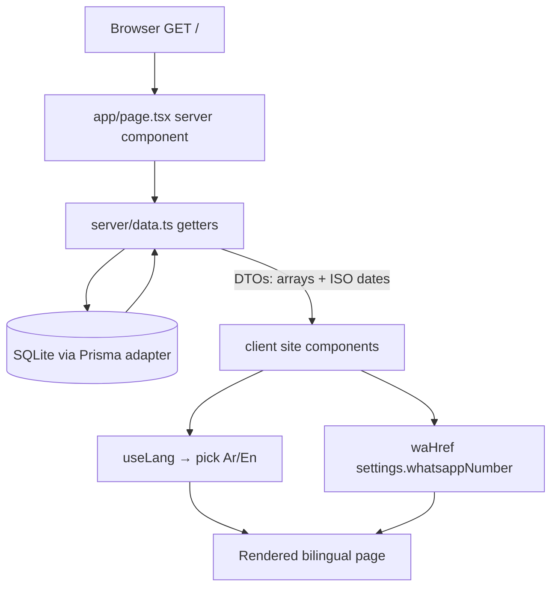
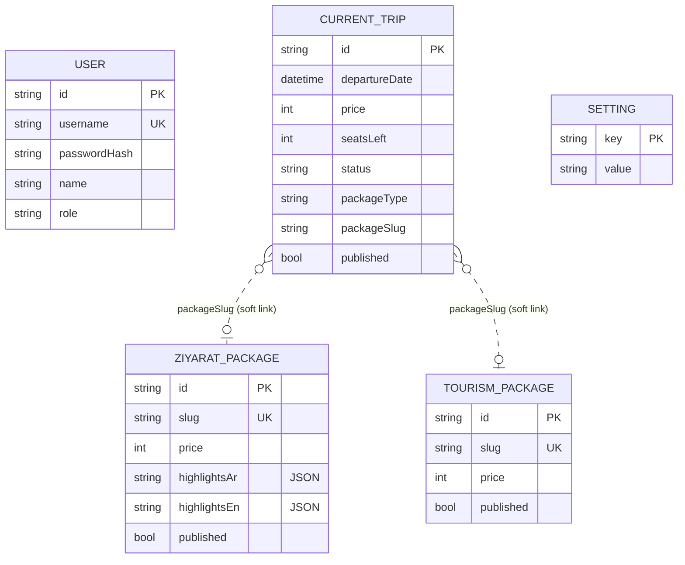

# Hamlet Al Khalil — Mindmap & Reference

A fast visual index of the codebase. Pair with [DOCUMENTATION.md](DOCUMENTATION.md) (detail)
and [../CLAUDE.md](../CLAUDE.md) (conventions). Diagrams are Mermaid — they render on GitHub
and in most Markdown previewers.

---

## Project mindmap

```mermaid
mindmap
  root((Hamlet Al Khalil))
    Public Site
      page.tsx (server, force-dynamic)
      server/data.ts (getters → DTOs)
      components/site
        Navbar
        Hero (+ CountUp)
        CurrentTrips (badges, links, WhatsApp)
        ZiyaratPackages
        TourismPackages
        TrustBar / Testimonials / InstagramFeed
        ArbaeenBanner
        Footer / FloatingButtons
        Reveal / CountUp (animation)
      LanguageContext (useLang → isRTL)
    Admin Dashboard
      login (public, Suspense)
      (panel) layout (session guard + Sidebar)
      Overview (counts, trips-by-status)
      Managers
        ZiyaratManager
        TourismManager
        TripsManager
        UsersManager
        SettingsManager
      ui.tsx primitives
      useResource hook
    Backend / API
      api/auth (login, logout)
      api/admin (ziyarat, tourism, trips, users, settings)
      proxy.ts (guard /admin, /api/admin)
    Lib
      prisma (adapter singleton)
      auth (jose session) 
      password (bcrypt)
      session (getSession)
      types (DTOs)
      serialize (JSON lists)
      settings (defaults + merge)
      whatsapp (waHref)
      api (input coercion)
    Data
      Prisma schema
        User
        ZiyaratPackage
        TourismPackage
        CurrentTrip
        Setting
      seed.ts
      SQLite dev.db
      data/content.ts (static copy)
    Config
      prisma.config.ts
      next.config.ts
      .env / .env.example
```

---

## Public request flow



## Admin + auth flow

```mermaid
flowchart TD
  U[Browser /admin/*] --> P{proxy.ts session valid?}
  P -- no --> L[/admin/login]
  L --> LP[POST /api/auth/login]
  LP --> V[verifyPassword bcrypt]
  V -->|ok| S[signSession jose → hk_session cookie]
  S --> D[Dashboard panel]
  P -- yes --> D
  D --> M[Manager component]
  M --> R[useResource → fetch /api/admin/*]
  R --> API{proxy: session on /api/admin?}
  API -- no --> E401[401]
  API -- yes --> H[route handler + Prisma]
  H --> DB[(SQLite)]
  H --> M
```

## Data model



> `CurrentTrip.packageType` + `packageSlug` are a **soft link** (no FK) that the public card
> turns into a `#ziyarat-<slug>` / `#tourism-<slug>` anchor.

---

## Where to change what

| I want to… | Touch these |
| --- | --- |
| Edit a public section's markup | `src/components/site/<Name>.tsx` |
| Change what data the homepage loads | `src/server/data.ts` + `src/app/page.tsx` |
| Add a field to a model | `prisma/schema.prisma` → `db:push` → `lib/types.ts` → `server/data.ts` → `api/admin/<res>` → `<Res>Manager.tsx` → public component |
| Add a new managed content type | model + seed → `server/data.ts` getter → `api/admin/<res>` routes → `<Res>Manager.tsx` + `admin/(panel)/<res>/page.tsx` → `Sidebar.tsx` → `page.tsx` |
| Change auth/session behavior | `src/lib/auth.ts`, `src/lib/session.ts`, `src/proxy.ts` |
| Add/adjust a site setting | `src/lib/settings.ts` (`SETTING_DEFAULTS`) + `src/lib/types.ts` + `SettingsManager.tsx` |
| Tune theme / animation | `src/app/globals.css` (+ `Reveal.tsx` / `CountUp.tsx`) |
| Change WhatsApp link logic | `src/lib/whatsapp.ts` |
| Adjust admin form inputs | `src/components/admin/ui.tsx` |

---

## Key files (single source of truth)

- Public entry: [../src/app/page.tsx](../src/app/page.tsx)
- Data access: [../src/server/data.ts](../src/server/data.ts)
- DTO types: [../src/lib/types.ts](../src/lib/types.ts)
- Prisma client: [../src/lib/prisma.ts](../src/lib/prisma.ts)
- Auth guard: [../src/proxy.ts](../src/proxy.ts)
- Schema: [../prisma/schema.prisma](../prisma/schema.prisma)
- Seed: [../prisma/seed.ts](../prisma/seed.ts)
